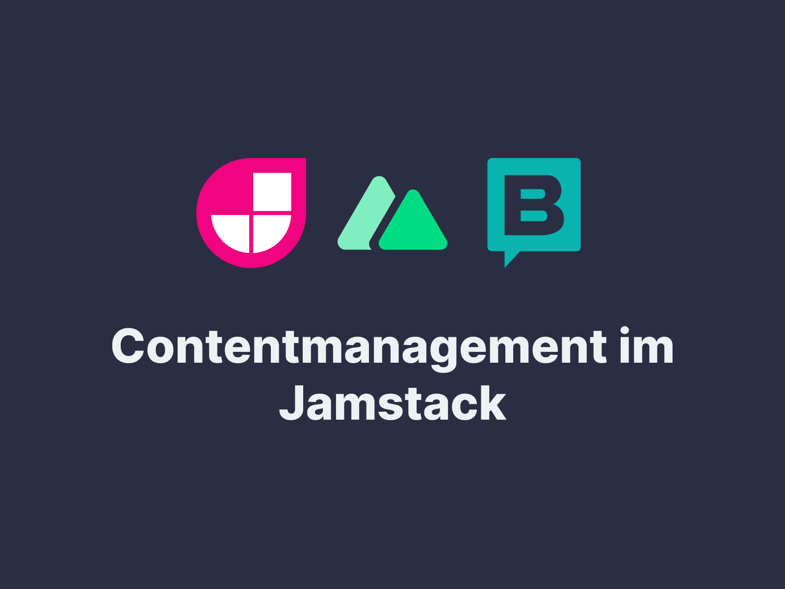

> ⚠️ In Bearbeitung



# Bachelorarbeit

Bachelorarbeit zum Thema: **Contentmanagement im Jamstack: redaktionelle Pflege von Websites in der Headless Architektur mit Nuxt 3 und Storyblok.**

Die Bachelorarbeit beschäftigt sich mit der Ausarbeitung praktischer Lösungsszenarien für die redaktionelle Pflege von Websites im Jamstack. Die erarbeiteten Lösungsszenarien sollen darstellen, wie sich die redaktionellen Aufgaben, die Entwickler aus der monolithischen Architektur gewohnt sind, im Jamstack zu lösen sind.

## Techstack

| Bereich            | Technologie                              | Notizen                                                                      |
| :----------------- | :--------------------------------------- | :--------------------------------------------------------------------------- |
| Frontend Framework | [Nuxt.js](https://v3.nuxtjs.org/)        | [Nuxt 3 (Beta) Release Candidate](https://nuxtjs.org/announcements/nuxt3-rc) |
| Headless CMS       | [Storyblok](https://www.storyblok.com/)  |                                                                              |
| CSS Framework      | [Tailwind CSS](https://tailwindcss.com/) | Tailwind v3                                                                  |
| Hosting            | [Netlify](https://netlify.com/)          | [Zur Live Website](https://bachelorarbeit.thenextbit.de/)                    |

---

## Storyblok einrichten (optional)

### 1. Private API-Key hinzufügen

> 💡 Dieser Schritt ist optional, da ein Public API-Key als Fallback integriert ist.

Der Private API-Key muss in die Umgebungsvariable `STORYBLOK_PRIVATE_KEY` in `.env`.

### 2. Storyblok v2 visueller Editor für die lokale Entwicklung

> 💡 Dieser Schritt ist optional, wenn Sie keinen Zugang zum Storyblok-Dashboard haben oder Storyblok v1 verwenden.

Der visuelle Editor für die lokale Entwicklung läuft in Storyblok v2 nur über https.

Installieren Sie zunächst [mkcert](https://github.com/FiloSottile/mkcert) auf ihrem Rechner.

Dann erstellen Sie ein Zertifikat:

```bash
mkcert localhost
```

Dann führen Sie Nuxt in https aus:

```bash
npm run dev:https
```

---

## Nuxt einrichten

Stellen Sie sicher, dass Sie die Abhängigkeiten installieren:

```bash
# yarn
yarn install

# npm
npm install

# pnpm
pnpm install --shamefully-hoist
```

## Node.js Version

Stellen Sie sicher, dass Sie eine kompatible Node.js Version installiert haben. Die Version ist in der Datei `.nvmrc` definiert. Der [Node Version Manager](https://npm.github.io/installation-setup-docs/installing/using-a-node-version-manager.html) kann Ihnen dabei helfen.

## Entwicklungsserver

Starten Sie den Entwicklungsserver unter http://localhost:3000

```bash
npm run dev
```

## Produktion

Generieren Sie die Website für die Produktion:

```bash
npm run generate
```

Weitere Informationen finden Sie in der [Dokumentation zum Deployment](https://v3.nuxtjs.org/guide/deploy/presets).

## Mehr erfahren

Mehr können Sie in der [Nuxt 3 Dokumentation](https://v3.nuxtjs.org) erfahren.
